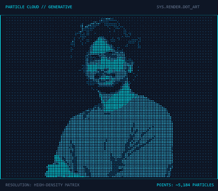
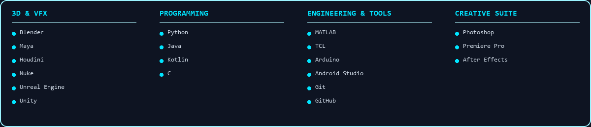

<table width="100%" border="0" cellspacing="0" cellpadding="0">
  <tr valign="top">
    <td width="49%" align="center">
      
    </td>
    <td width="2%">&nbsp;</td>
    <td width="49%" align="center">
      
    </td>
  </tr>
</table>

 

## SKILLS & TOOLS

 

## GITHUB ANALYTICS

<table width="100%" border="0" cellspacing="0" cellpadding="0">
  <tr valign="top">
    <td width="49%" align="center">
      
    </td>
    <td width="2%">&nbsp;</td>
    <td width="49%" align="center">
      
    </td>
  </tr>
</table>

 

## CONNECT

<table border="0" cellspacing="0" cellpadding="0">
  <tr>
    <td align="center">
      
    </td>
    <td width="12">&nbsp;</td>
    <td align="center">
      
    </td>
    <td width="12">&nbsp;</td>
    <td align="center">
      
    </td>
    <td width="12">&nbsp;</td>
    <td align="center">
      
    </td>
  </tr>
</table>

 

