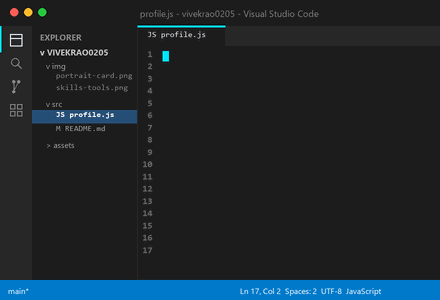
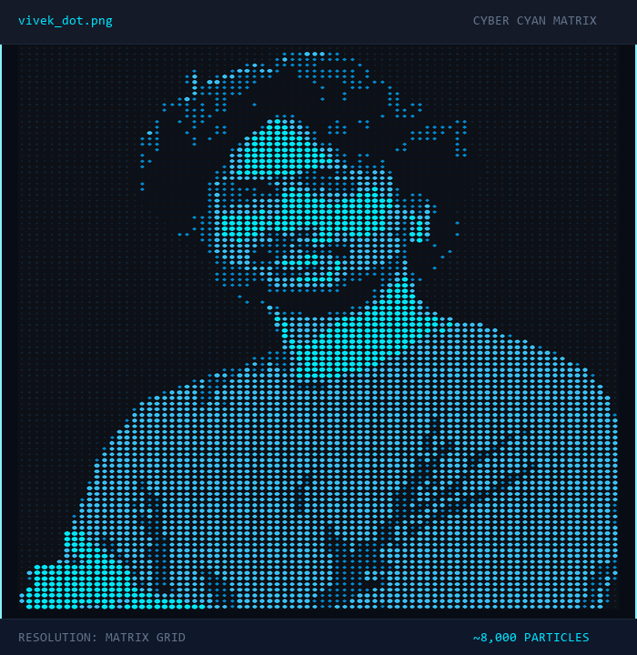

<table width="100%" border="0" cellspacing="0" cellpadding="0">
  <tr valign="top">
    <td width="49%" align="center">
      
    </td>
    <td width="2%">&nbsp;</td>
    <td width="49%" align="center">
      
    </td>
  </tr>
</table>

 

## ABOUT ME

Hey! I’m Vivek Rao, a 3D Artist and ECE student who loves blending creativity with technology.

I’m deeply fascinated by VFX, Programming, AI, and everything that turns imagination into reality.

 

## SKILLS & TOOLS

| 3D & VFX | Programming | Development | Engineering & AI |
| :--- | :--- | :--- | :--- |
| Blender | Java | React | MATLAB |
| Maya | Python | Next.js | TCL |
| Houdini | C | Android | Arduino |
| After Effects | Kotlin | Firebase | Python AI |
| Premiere Pro | TypeScript | Git | AI APIs |
| Photoshop | JavaScript | GitHub | Automation |

 

## GITHUB ANALYTICS

<table width="100%" border="0" cellspacing="0" cellpadding="0">
  <tr valign="top">
    <td width="49%" align="center">
      
    </td>
    <td width="2%">&nbsp;</td>
    <td width="49%" align="center">
      
    </td>
  </tr>
</table>

 

## CONNECT

<table border="0" cellspacing="0" cellpadding="0">
  <tr>
    <td align="center">
      
    </td>
    <td width="15">&nbsp;</td>
    <td align="center">
      
    </td>
    <td width="15">&nbsp;</td>
    <td align="center">
      
    </td>
  </tr>
</table>

 

`vivekrao6485@gmail.com`

