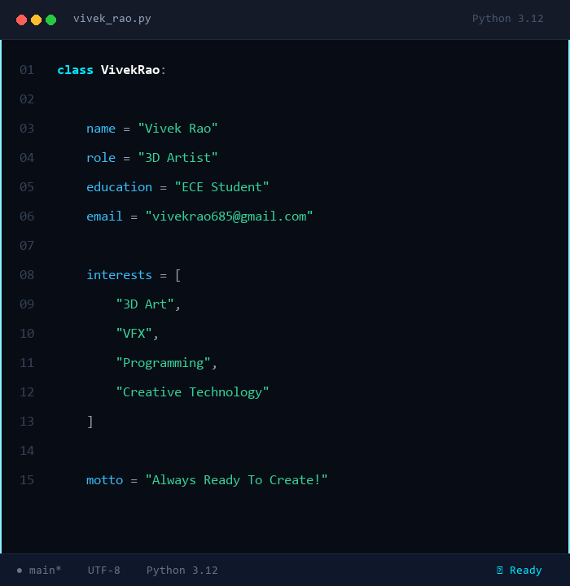

<!-- README HEADER -->

  

<!-- HERO SECTION: MACBOOK CODE PANEL & CYBER CYAN DOT PORTRAIT -->
<table width="100%" border="0" cellspacing="0" cellpadding="0">
<tr valign="top">
<td width="49%" align="center">

</td>
<td width="2%">&nbsp;</td>
<td width="49%" align="center">

</td>
</tr>
</table>

  

<!-- GITHUB ANALYTICS & TOP LANGUAGES SECTION -->
<table width="100%" border="0" cellspacing="0" cellpadding="0">
<tr>
<td align="left">
<b>GITHUB ANALYTICS & TOP LANGUAGES</b>
</td>
</tr>
</table>

 

<table width="100%" border="0" cellspacing="0" cellpadding="0">
<tr valign="top">
<td width="49%" align="center" bgcolor="#0D1117" style="padding: 10px; border: 1px solid rgba(0, 229, 255, 0.25); border-radius: 12px;">

</td>
<td width="2%">&nbsp;</td>
<td width="49%" align="center" bgcolor="#0D1117" style="padding: 10px; border: 1px solid rgba(0, 229, 255, 0.25); border-radius: 12px;">

</td>
</tr>
</table>

  

<!-- GITHUB ACTIVITY GRAPH SECTION -->
<table width="100%" border="0" cellspacing="0" cellpadding="0">
<tr>
<td align="left">
<b>GITHUB ACTIVITY</b>
</td>
</tr>
</table>

 

<table width="100%" border="0" cellspacing="0" cellpadding="0">
<tr>
<td align="center" bgcolor="#0D1117" style="padding: 16px; border: 1px solid rgba(0, 229, 255, 0.25); border-radius: 12px;">

</td>
</tr>
</table>

  

<!-- CORE STACK SECTION -->
<table width="100%" border="0" cellspacing="0" cellpadding="0">
<tr>
<td align="left">
<b>CORE STACK</b>
</td>
</tr>
</table>

 

